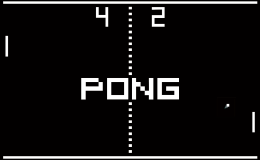

# ft_transcendence
> Version: 14.1

  

    <h2>Essential Points</h2>
  

  
  This project is a complex undertaking, requiring decision-making within the specified constraints.  
  You have some flexibility in implementing certain modules, 
  and it is left to your discretion **within the scope of the subject**.  
  All your choices must be justifiable.  

  If you believe it’s necessary to use *nginx* to set up your website,
  there’s no issue, but ask yourself first, is it truly necessary?  
  Can I do without it?

  Similarly, when faced with a library that could assist you,
  it’s crucial to understand whether it will fulfill your tasks.  
  You’re not expected to rework uninteresting sub-layers
  but rather to make the proposed features function.  

  It’s crucial to understand that you’ll encounter decisions where
  doubts about implementing certain features will arise.  

  Initially, it is **STRONGLY recommended** to comprehend the project requirements thoroughly.  
  Once you’ve grasped what needs to be accomplished,
  it is necessary to stay within the framework of the project.  

  When we mention an imposed technology, it explicitly means that
  everything officially related to the requested framework/language is allowed.  

  However, we emphasize that when you wish to implement a module,
  all restrictions apply to that module.  
  For instance, if you want to realize the project with
  the Backend module as specified in the subject,
  you can no longer use the default language and must adapt your project accordingly.  
  If you still want to create a backend using the default language,
  it’s also possible, but since you’re not using the requested language/framework,
  this module will not be considered valid.  

  Before concluding, it’s important to note that
  some modules intentionally have strong dependencies on others.  

  Your choices are significant and must be justified during your evaluation.  
  Exercise caution.  

  Take the time to contemplate the design of your application with your choices
  before delving into the code – it’s crucial.  
  Have a fun ! :)

  

  

    <h2>Mandatory part</h2>
  

  This project is about creating a website for the mighty **Pong** contest!  

  > The use of libraries or frameworks or tools to replace your job is strictly prohibited.  
  > Each part of the subject will explicitly present the authorized third party software you can use.  
  > Nevertheless, it is allowed and even recommended to use anything possible to simplify certain actions.  
  > It is important to note that any tools or resources utilized must be justified.  
  > Please be aware that simplifying does not equate to completing your work.  

  

    <h3>Overview</h3>
  

  Thanks to your website, users will play Pong with others.  
  You have to provide a nice user interface and real-time multiplayer online games!  

• Your project needs to adhere to the following guidelines as a minimum requirement,
contributing only a small portion to the final grade.  

• The second part of this subject will offer additional modules that can replace or complete the following rules.

In this Subject, certain words are ~~highlighted in green~~ 🔸Bordered like this🔸.  
These represent technology choices that will evolve over time.  
Pay close attention to the version of the subject.

  

    <h3>Minimal technical requirement</h3>
  

Your project has to comply with the following rules:  

> Again, some of these constraints could be overridden by the choice of specific modules.

You are free to develop the site, with or without a backend.  

If you choose to include a backend, 
it must be written in pure 🔸Ruby🔸.  
However, this requirement can be overridden by the **Framework module**.  

If your backend or framework uses a database,  
you must follow the constraints of the **Database module**.  

The frontend should be developed using pure vanilla 🔸Javascript🔸.  
However, this requirement can be altered through the **FrontEnd module**.  

Your website must be a [single-page application](https://en.wikipedia.org/wiki/Single-page_application).  
The user should be able to use the **Back** and **Forward** buttons of the browser.

Your website must be compatible with the **latest stable up-to-date version** of 🔸Google Chrome🔸.  

The user should encounter no unhandled errors and no warnings when browsing the website.  

Everything must be launched with a single command line to run an autonomous container provided by 🔸Docker🔸.  
Example : `docker-compose up --build`  

> *If your container solution is Docker:*  
> When your computers in clusters run under Linux, you will use Docker in rootless mode for security reasons.  
> This comes with 2 sideways:  
>  
>   • Your Docker runtime files must be located in /goinfre or /sgoinfre.
>  
>   • You can’t use so called “bind-mount volumes” between the host and the container if non-root UIDs are used in the container.  
>  
> Depending on the project, your situation and the context, several fallbacks exist:  
> Docker in a VM, rebuild you container after your changes, craft your own docker image with root as unique UID.  

  

    <h3>Game</h3>
  

The main purpose of this website is to play Pong versus other players.  

• Therefore, users must have the ability to participate in a live Pong game against another player directly on the website.  
Both players will use the same keyboard.  
The [**Remote players module**]() can enhance this functionality with remote players.

• A player must be able to play against another player, but it should also be possible to propose a **tournament**.  
This tournament will consist of multiple players who can take turns playing against each other.  
You have flexibility in how you implement the tournament,  
but it must clearly display who is playing against whom and the order of the players.  

• A **registration system** is required:  
At the start of a tournament, each player must input their alias name.  
The aliases will be reset when a new tournament begins.  
However, this requirement can be modified using the [**Standard User Management module**]().  

• There must be a **matchmaking system**:  
The tournament system organizes the matchmaking of the participants, and announces the next fight.  

• All players must adhere to the same rules,
which includes having identical paddle speed.  
This requirement also applies when using AI;  
the AI must exhibit the same speed as a regular player.  

• The game itself must be developed in accordance with the default frontend constraints (as outlined above),  
or you may choose to utilize the [**FrontEnd module**](),
or you have the option to override it with the [**Graphics module**]().  
While the visual aesthetics can vary,
it must still capture the essence of the **original Pong** (1972).

> The use of libraries or frameworks or tools to replace your job is strictly prohibited.  
> Each part of the subject will explicitly present the authorized third party software you can use.  
> Nevertheless, it is allowed and even recommended to use anything possible to simplify certain actions.  
> It is important to note that any tools or resources utilized must be justified.  
> Please be aware that simplifying does not equate to completing your work.  

  

    <h3>Security concerns</h3>
  

In order to create a basic functional website,
here are a few security concerns that you have to tackle:  

• Any password stored in your database,
if applicable, must be **hashed**.  

• Your website must be protected against **SQL injections/XSS**.  

• If you have a backend or any other features, 
it is mandatory to enable an HTTPS connection for all aspects (Utilize wss instead of ws...).  

• You must implement some form of validation for forms and any user input,  
either within the base page if no backend is used or on the server side if a backend is employed.  

> Please make sure you use a strong password hashing algorithm  

> For obvious security reasons, any credentials, API keys, env variables etc...  
> must be saved locally in a .env file and ignored by git.
> Publicly stored credentials will lead you directly to a failure of the project.  

  

    <h2>Modules</h2>
  

Now that you’ve accomplished 25% of the project, congratulations!  

With a functional basic website in place,  
the next step is to choose modules for further improvement.  

To attain 100% project completion, a minimum of **7 major modules is required**.  
It’s crucial to carefully review each module as it may necessitate modifications to your baseline website.  

Therefore, we strongly recommend reading this entire subject thoroughly.  

> The use of libraries or frameworks or tools to replace your job is strictly prohibited.  
> Each part of the subject will explicitly present the authorized third party software you can use.  
> Nevertheless, it is allowed and even recommended to use anything possible to simplify certain actions.  
> It is important to note that any tools or resources utilized must be justified.  
> Please be aware that simplifying does not equate to completing your work.  

> Two Minor Modules are equivalent to one Major Module.

  
<h3>Overview</h3>

• [**Web**]()  
◦ **Major module**: Use a Framework as backend.  
◦ **Minor module**: Use a front-end framework or toolkit.  
◦ **Minor module**: Use a database for the backend.  
◦ **Major module**: Store the score of a tournament in the Blockchain.  

• [**User Management**]()  
◦ **Major module**: Standard user management, authentication, users across tournaments.  
◦ **Major module**: Implementing a remote authentication.  

• [**Gameplay and user experience**]()  
◦ **Major module**: Remote players  
◦ **Major module**: Multiplayers (more than 2 in the same game).  
◦ **Major module**: Add Another Game with User History and Matchmaking.  
◦ **Minor module**: Game Customization Options.  
◦ **Major module**: Live chat.  

• [**AI-Algo**]()  
◦ **Major module**: Introduce an AI Opponent.  
◦ **Minor module**: User and Game Stats Dashboards  

• [**Cybersecurity**]()  
◦ **Major module**: Implement WAF/ModSecurity with Hardened Configuration and HashiCorp Vault for Secrets Management.  
◦ **Minor module**: GDPR Compliance Options with User Anonymization, Local Data Management, and Account Deletion.  
◦ **Major module**: Implement Two-Factor Authentication (2FA) and JWT.  

• [**Devops**]()  
◦ **Major module**: Infrastructure Setup for Log Management.  
◦ **Minor module**: Monitoring system.  
◦ **Major module**: Designing the Backend as Microservices.  

• [**Graphics**]()  
◦ **Major module**: Use of advanced 3D techniques.  

• [**Accessibility**]()  
◦ **Minor module**: Support on all devices.  
◦ **Minor module**: Expanding Browser Compatibility.  
◦ **Minor module**: Multiple language supports.  
◦ **Minor module**: Add accessibility for Visually Impaired Users.  
◦ **Minor module**: Server-Side Rendering (SSR) Integration.  

• [**Server-Side Pong**]()  
◦ **Major module**: Replacing Basic Pong with Server-Side Pong and Implementing an API.  
◦ **Major module**: Enabling Pong Gameplay via CLI against Web Users with API Integration.  

  

    <h3>Web</h3>
  

These modules enable the integration of advanced web features into your Pong game.  

• **Major module**: Use a Framework as backend.  
In this major module, you are required to utilize a specific web framework for your backend development,  
and that framework is 🔸Django🔸.  

> You can create a backend without using the constraints of this module by using the default language/framework.  
> However, this module will only be valid if you use the associated constraints.  

• **Minor module**: Use a front-end framework or toolkit.  
Your frontend development will utilize the 🔸Bootstrap toolkit🔸.  

> You can create a front-end without using the constraints of this module by using the default language/framework.  
> However, this module will only be valid if you use the associated constraints.  

• Minor module: Use a database for the backend -and more.  
The designated database for all DB instances in your project is 🔸PostgreSQL🔸.  
This choice guarantees data consistency and compatibility across all project components 
and may be a prerequisite for other modules, such as the **backend Framework module**.  

• Major module: Store the score of a tournament in the Blockchain.  
This Major module focuses on implementing a feature within the Pong website to store tournament scores securely on a blockchain.  
It is essential to clarify that for development and testing purposes, we will utilize a testing blockchain environment.  
The chosen blockchain for this implementation is 🔸Ethereum🔸,  
and 🔸Solidity🔸 will be the programming language used for smart contract development.  

◦ Blockchain Integration: The primary goal of this module is to seamlessly integrate blockchain technology, 
specifically 🔸Ethereum🔸, into the Pong website.  
This integration ensures the secure and immutable storage of tournament scores, 
providing players with a transparent and tamper-proof record of their gaming achievements.  

◦ 🔸Solidity🔸 Smart Contracts: To interact with the blockchain, 
we will develop 🔸Solidity🔸 smart contracts.  
These contracts will be responsible for recording,
managing, and retrieving tournament scores.  

◦Testing Blockchain: As mentioned earlier, a testing blockchain will be employed for development and testing purposes.  
This ensures that all blockchain-related functionalities are thoroughly validated without any risks associated with a live blockchain.  

Interoperability: This module may have dependencies on other modules, particularly the Backend Framework module.  
Integrating blockchain functionality might necessitate adjustments in the backend to accommodate interactions with the blockchain.  

By implementing this module, we aim to enhance the Pong website by introducing a blockchain-based score storage system.  

Users will benefit from the added layer of security and transparency,  
ensuring the integrity of their gaming scores.  
The module emphasizes the use of a testing blockchain environment to minimize risks associated with blockchain development.  

---
(wip)
---

User Management
This module delves into the realm of User Management, addressing crucial aspects
of user interactions and access control within the Pong platform.
It encompasses two major components,
each focused on essential elements of user management and authentication: user participation across multiple tournaments and the implementation of remote authentication.

• Major module: Standard user management, authentication, users across tournaments.

◦ Users can subscribe to the website in a secure way.
◦ Registered users can log in in a secure way.
◦ Users can select a unique display name to play the tournaments.
◦ Users can update their information.
◦ Users can upload an avatar, with a default option if none is provided.
◦ Users can add others as friends and view their online status.
◦ User profiles display stats, such as wins and losses.
◦ Each user has a Match History including 1v1 games, dates, and relevant details, accessible to logged-in users.

Be carefull, the management of duplicate usernames/emails is at your discretion.
You must provide a justification for your decision.

..

Major module: Implementing a remote authentication.
In this major module, the goal is to implement the following authentication system:
OAuth 2.0 authentication with 42.

Key features and objectives include:
◦ Integrate the authentication system, allowing users to securely sign in.
◦ Obtain the necessary credentials and permissions from the authority to enable a secure login.
◦ Implement user-friendly login and authorization flows that adhere to best practices and security standards.
◦ Ensure the secure exchange of authentication tokens and user information between the web application and the authentication provider.

This major module aims to get a remote user authentication, providing users with a secure and convenient way to access the web application.

..

Gameplay and user experience
These modules are designed to enhance the general gameplay of the project.

• Major module: Remote players
It is possible to have two distant players.
Each player is located on a separated computer, accessing the same website and playing the same Pong game.

Think about network issues, like unexpected disconnection or lag.
You have to offer the best user experience possible.

• Major module: Multiple players
It is possible to have more than two players.
Each player needs a live control (so the previous “Distant players” module is highly recommended).
It’s up to you to define how the game could be played with 3, 4, 5, 6 ... players.
Along with the regular 2 players game,
you can choose a single number of players, greater than 2, for this multiplayer module.

Ex: 4 players can play on a squarred board, each player owns one unique side of the square.

• Major module: Add Another Game with User History and Matchmaking.
In this major module, the objective is to introduce a new game, distinct from Pong, and incorporate features such as user history tracking and matchmaking.

Key features and goals include:
◦ Develop a new, engaging game to diversify the platform’s offerings and entertain users.
◦ Implement user history tracking to record and display individual user’s gameplay statistics.
◦ Create a matchmaking system to allow users to find opponents and participate in fair and balanced matches.
◦ Ensure that user game history and matchmaking data are stored securely and remain up-to-date.
◦ Optimize the performance and responsiveness of the new game to provide an enjoyable user experience.
Regularly update and maintain the game to fix
bugs, add new features, and enhance gameplay.

This major module aims to expand your platform by introducing a new game, enhancing user engagement with gameplay history, and facilitating matchmaking for an enjoyable gaming experience.

• Minor module: Game Customization Options.
In this minor module, the goal is to provide customization options for all available games on the platform.

Key features and objectives include:
◦ Offer customization features, such as power-ups, attacks, or different maps, that enhance the gameplay experience.
◦ Allow users to choose a default version of the game with basic features if they prefer a simpler experience.
◦ Ensure that customization options are available and applicable to all games offered on the platform.
◦ Implement user-friendly settings menus or interfaces for adjusting game parameters.
◦ Maintain consistency in customization features across all games to provide a unified user experience.

This module aims to give users the flexibility to tailor their gaming experience across all available games by providing a variety of customization options while also offering a default version for those who prefer a straightforward gameplay
experience.

• Major module: Live Chat.
You have to create a chat for your users in this module:
◦ The user should be able to send direct messages to other users.
◦ The user should be able to block other users. This way, they will see no more messages from the account they blocked.
◦ The user should be able to invite other users to play a Pong game through the chat interface.
◦ The tournament system should be able to warn users expected for the next game.
◦ The user should be able to access other players profiles through the chat interface.

..

AI-Algo

These modules serve to introduce data-driven elements to the project,
with the major module introducing an AI opponent for enhanced gameplay,
and the minor module focusing on user and game statistics dashboards, offering users a minimalistic yet insightful glimpse into their gaming experiences.

• Major module: Introduce an AI Opponent.
In this major module, the objective is to incorporate an AI player into the game.

Notably, the use of the A* algorithm is not permitted for this task.

Key features and goals include:
◦ Develop an AI opponent that provides a challenging and engaging gameplay experience for users.
◦ The AI must replicate human behavior, meaning that in your AI implementation, you must simulate keyboard input.

The constraint here is that the AI can only refresh its view of the game once per second, requiring it to anticipate bounces and other actions.

The AI must utilize power-ups if you have chosen to implement the Game customization options module.

◦ Implement AI logic and decision-making processes that enable the AI player to make intelligent and strategic moves.
◦ Explore alternative algorithms and techniques to create an effective AI player without relying on A*.
◦ Ensure that the AI adapts to different gameplay scenarios and user interactions.

Attention: You will need to explain in detail how your AI functions during your evaluation.

Creating an AI that does nothing is strictly
prohibited; it must have the capability to win occasionally.

This major module aims to enhance the game by introducing an AI opponent that adds excitement and competitiveness without relying on the A* algorithm.

• Minor module: User and Game Stats Dashboards.
In this minor module, the goal is to introduce dashboards that display statistics for individual users and game sessions.

Key features and objectives include:
◦ Create user-friendly dashboards that provide users with insights into their own
gaming statistics.
◦ Develop a separate dashboard for game sessions, showing detailed statistics, outcomes, and historical data for each match.
◦ Ensure that the dashboards offer an intuitive and informative user interface for tracking and analyzing data.
◦ Implement data visualization techniques, such as charts and graphs, to present statistics in a clear and visually appealing manner.
◦ Allow users to access and explore their own gaming history and performance metrics conveniently.
◦ Feel free to add any metrics you deem useful.

This minor module aims to empower users with the ability to monitor their gaming statistics and game session details through user-friendly dashboards,
providing a comprehensive view of their gaming experience.

...

Cybersecurity

These cybersecurity modules are designed to bolster the security posture of the project, with the major module focusing on robust protection through Web Application Firewall (WAF) and ModSecurity configurations and HashiCorp Vault for secure secrets management.
The minor modules complement this effort by adding options for GDPR compliance, user data anonymization, account deletion, two-factor authentication (2FA), and JSON Web Tokens (JWT), collectively ensuring the project’s commitment to data protection, privacy, and authentication security.

• Major module: Implement WAF/ModSecurity with Hardened Configuration and HashiCorp Vault for Secrets Management.

In this major module, the objective is to enhance the security infrastructure of the project by implementing several key components.

Key features and goals include:
◦ Configure and deploy a Web Application Firewall (WAF) and ModSecurity with a strict and secure configuration to protect against web-based attacks.
◦ Integrate HashiCorp Vault to securely manage and store sensitive information, such as API keys, credentials, and environment variables, ensuring that these secrets are properly encrypted and isolated.

This major module aims to bolster the project’s security infrastructure by implementing robust security measures, including WAF/ModSecurity for web application protection and HashiCorp Vault for secrets management to ensure a safe and secure environment.

• Minor module: GDPR Compliance Options with User Anonymization, Local Data Management, and Account Deletion.

In this minor module, the goal is to introduce GDPR compliance options that allow users to exercise their data privacy rights.

Key features and objectives include:
◦ Implement GDPR-compliant features that enable users to request anonymization of their personal data, ensuring that their identity and sensitive information are protected.
◦ Provide tools for users to manage their local data, including the ability to view, edit, or delete their personal information stored within the system.
◦ Offer a streamlined process for users to request the permanent deletion of their accounts, including all associated data, ensuring compliance with data protection regulations.
◦ Maintain clear and transparent communication with users regarding their data privacy rights,
with easily accessible options to exercise these rights.

This minor module aims to enhance user privacy and data protection by offering GDPR compliance options that empower users to control their personal information and exercise their data privacy rights within the system.

If you are not familiar with the General Data Protection Regulation (GDPR),
it is essential to understand its principles and implications, especially regarding user data management and privacy.

The GDPR is a regulation that aims to protect the
personal data and privacy of individuals within the European Union (EU) and the European Economic Area (EEA).

It sets out strict rules and guidelines for organi-
zations on how they should handle and process personal data.

To gain a better understanding of the GDPR and its requirements,
it is highly recommended to visit the official website of the European Commission on data
protection1.

This website provides comprehensive information about the GDPR, including its principles, objectives, and user rights. It also offers additional
resources to delve deeper into the topic and ensure compliance with the regulation.

If you are unfamiliar with the GDPR, please take the time to visit the provided link and familiarize yourself with the regulations before proceeding with this project.

• Major module: Implement Two-Factor Authentication (2FA) and JWT.
In this major module, the goal is to enhance security and user authentication by introducing Two-Factor Authentication (2FA) and utilizing JSON Web Tokens (JWT). Key features and objectives include:
◦ Implement Two-Factor Authentication (2FA) as an additional layer of security for user accounts, requiring users to provide a secondary verification method, such as a one-time code, in addition to their password.
◦ Utilize JSON Web Tokens (JWT) as a secure method for authentication and authorization, ensuring that user sessions and access to resources are managed securely.
◦ Provide a user-friendly setup process for enabling 2FA, with options for SMS codes, authenticator apps, or email-based verification.
◦ Ensure that JWT tokens are issued and validated securely to prevent unauthorized access to user accounts and sensitive data.

This major module aims to strengthen user account security by offering Two-Factor
Authentication (2FA) and enhancing authentication and authorization through the
use of JSON Web Tokens (JWT).

https://commission.europa.eu/law/law-topic/data-protection/data-protection-eu_en

..

Devops

These modules collectively focus on enhancing the project’s infrastructure and architecture,
with the major modules addressing infrastructure setup for efficient log management using ELK (Elasticsearch, Logstash, Kibana), designing the backend as microservices for flexibility and scalability, and implementing Prometheus/Grafana for comprehensive system monitoring.

• Major module: Infrastructure Setup with ELK (Elasticsearch, Logstash, Kibana) for Log Management.

In this major module, the objective is to establish a robust infrastructure for log management and analysis using the ELK stack (Elasticsearch, Logstash, Kibana).

Key features and goals include:
◦ Deploy Elasticsearch to efficiently store and index log data, making it easily searchable and accessible.
◦ Configure Logstash to collect, process, and transform log data from various sources and send it to Elasticsearch.
◦ Set up Kibana for visualizing log data, creating dashboards, and generating insights from log events.
◦ Define data retention and archiving policies to manage the storage of log data effectively.
◦ Implement security measures to protect log data and access to the ELK stack components.

This major module aims to establish a powerful log management and analysis system using the ELK stack, enabling effective troubleshooting, monitoring, and insights into the system’s operation and performance.

• Minor module: Monitoring system.
In this minor module, the objective is to set up a comprehensive monitoring system using Prometheus and Grafana.

Key features and goals include:
◦ Deploy Prometheus as the monitoring and alerting toolkit to collect metrics and monitor the health and performance of various system components.
◦ Configure data exporters and integrations to capture metrics from different services, databases, and infrastructure components.
◦ Create custom dashboards and visualizations using Grafana to provide realtime insights into system metrics and performance.
◦ Set up alerting rules in Prometheus to proactively detect and respond to critical issues and anomalies.
◦ Ensure proper data retention and storage strategies for historical metrics data.
◦ Implement secure authentication and access control mechanisms for Grafana to protect sensitive monitoring data.

This minor module aims to establish a robust monitoring infrastructure using
Prometheus and Grafana,
enabling real-time visibility into system metrics and proactive issue detection for improved system performance and reliability.

• Major module: Designing the Backend as Microservices.
In this major module, the goal is to architect the backend of the system using a microservices approach.

Key features and objectives include:
◦ Divide the backend into smaller, loosely-coupled microservices, each responsible for specific functions or features.
◦ Define clear boundaries and interfaces between microservices to enable independent development, deployment, and scaling.
◦ Implement communication mechanisms between microservices, such as REST-
ful APIs or message queues, to facilitate data exchange and coordination.
◦ Ensure that each microservice is responsible for a single, well-defined task or business capability, promoting maintainability and scalability.

This major module aims to enhance the system’s architecture by adopting a microservices design approach,
enabling greater flexibility, scalability, and maintainability of the backend components.
..
Gaming
These modules are designed to enhance the gamification aspect of the project, with the
major module introducing new games, user history tracking, and matchmaking, while the
minor module focuses on providing customization options across all available games.
• Major module: Add Another Game with User History and Matchmaking.

In this major module, the objective is to introduce a new game, distinct from Pong, and incorporate features such as user history tracking and matchmaking.

Key features and goals include:
◦ Develop a new, engaging game to diversify the platform’s offerings and enter-
tain users.
◦ Implement user history tracking to record and display individual user’s gameplay statistics.
◦ Create a matchmaking system to allow users to find opponents and participate in fair and balanced matches.
◦ Ensure that user game history and matchmaking data are stored securely and remain up-to-date.
◦ Optimize the performance and responsiveness of the new game to provide an enjoyable user experience.

Regularly update and maintain the game to fix
bugs, add new features, and enhance gameplay.
This major module aims to expand your platform by introducing a new game, enhancing user engagement with gameplay history, and facilitating matchmaking for an enjoyable gaming experience.

• Minor module: Game Customization Options.
In this minor module, the goal is to provide customization options for all available games on the platform.

Key features and objectives include:

◦ Offer customization features, such as power-ups, attacks, or different maps, that enhance the gameplay experience.
◦ Allow users to choose a default version of the game with basic features if they prefer a simpler experience.
◦ Ensure that customization options are available and applicable to all games offered on the platform.
◦ Implement user-friendly settings menus or interfaces for adjusting game parameters.
◦ Maintain consistency in customization features across all games to provide a unified user experience.

This module aims to give users the flexibility to tailor their gaming experience across all available games by providing a variety of customization options while also offering a default version for those who prefer a straightforward gameplay
experience.

..

Graphics
• Major module: Implementing Advanced 3D Techniques
This major module, known as "Graphics," is focused on enhancing the visual aspects of the Pong game.
It introduces the utilization of advanced 3D techniques to create a more immersive gaming experience.

Specifically, the Pong game will be developed
using ThreeJS/WebGL to achieve the desired visual effects.
◦ Advanced 3D Graphics: The primary goal of this module is to implement advanced 3D graphics techniques to elevate the visual quality of the Pong game.

By utilizing ThreeJS/WebGL , we aim to create stunning visual effects that immerse players in the gaming environment.

◦ Immersive Gameplay: The incorporation of advanced 3D techniques enhances the overall gameplay experience by providing users with a visually engaging and captivating Pong game.

◦ Technology Integration: The chosen technology for this module is ThreeJS/WebGL .

These tools will be used to create the 3D graphics, ensuring compatibility and optimal performance.

This major module aims to revolutionize the Pong game’s visual elements by introducing advanced 3D techniques.

Through the utilization of TreeJS/WebGL,
we aspire to provide players with an immersive and visually stunning gaming experience.

..

Accessibility

These modules are designed to enhance the accessibility of our web application, with a focus on ensuring compatibility across all devices, expanding browser support, offering multi-language capabilities, providing accessibility features for visually impaired users, and integrating Server-Side Rendering (SSR) for improved performance and user experience.

• Minor module: Support on all devices.
In this module, the main focus is to ensure that your website works seamlessly on all types of devices.

Key features and objectives include:
◦ Make sure the website is responsive, adapting to different screen sizes and orientations, ensuring a consistent user experience on desktops, laptops, tablets, and smartphones.
◦ Ensure that users can easily navigate and interact with the website using different input methods,
such as touchscreens, keyboards, and mice, depending on the device they are using.

This module aims to provide a consistent and user-friendly experience on all devices,
maximizing accessibility and user satisfaction.

• Minor module: Expanding Browser Compatibility.
In this minor module, the objective is to enhance the compatibility of the web application by adding support for an additional web browser.

Key features and objectives include:
◦ Extend browser support to include an additional web browser, ensuring that users can access and use the application seamlessly.
◦ Conduct thorough testing and optimization to ensure that the web application functions correctly and displays correctly in the newly supported browser.
◦ Address any compatibility issues or rendering discrepancies that may arise in the added web browser.
◦ Ensure a consistent user experience across all supported browsers, maintaining usability and functionality.

This minor module aims to broaden the accessibility of the web application by supporting an additional web browser, providing users with more choices for their browsing experience.

• Minor module: Multiple language supports.
In this minor module, the objective is to ensure that your website supports multiple languages to cater to a diverse user base.

Key features and goals include:
◦ Implement support for a minimum of three languages on the website to accommodate a broad audience.
Provide a language switcher or selector that allows users to easily change the website’s language based on their preferences.
◦ Translate essential website content, such as navigation menus, headings, and key information, into the supported languages.
◦ Ensure that users can navigate and interact with the website seamlessly, regardless of the selected language.
◦ Consider using language packs or localization libraries to simplify the translation process and maintain consistency across different languages.
◦ Allow users to set their preferred language as a default choice for subsequent visits to the website.

This minor module aims to enhance the accessibility and inclusivity of your website by offering content in multiple languages, making it more user-friendly for a diverse international audience.

• Minor module: Add accessibility for Visually Impaired Users.
In this minor module, the goal is to make your website more accessible for visually impaired users.

Key features include:
◦ Support for screen readers and assistive technologies.
◦ Clear and descriptive alt text for images.
◦ High-contrast color scheme for readability.
◦ Keyboard navigation and focus management.
◦ Options for adjusting text size.
◦ Regular updates to meet accessibility standards.

This module aims to improve the website’s usability for individuals with visual impairments and ensure compliance with accessibility standards.

• Minor module: Server-Side Rendering (SSR) Integration.
In this minor module, the focus is on integrating Server-Side Rendering (SSR) to enhance the performance and user experience of your website.

Key objectives include:
◦ Implement SSR to improve the website’s loading speed and overall performance.
◦ Ensure that content is pre-rendered on the server and delivered to users’ browsers for faster initial page loads.
◦ Optimize SEO by providing search engines with pre-rendered HTML content.
◦ Maintain a consistent user experience while benefiting from the advantages of SSR.

This module aims to boost website performance and SEO by integrating Server-Side Rendering for faster page loads and improved user experience.

..

Server-Side Pong

• Major module: Replacing Basic Pong with Server-Side Pong and Implementing an API.

In this major module, the goal is to replace the basic Pong game with a server-side Pong game, accompanied by the implementation of an API. 

Key features and objectives include:
◦ Develop server-side logic for the Pong game to handle gameplay, ball movement, scoring, and player interactions.
◦ Create an API that exposes the necessary resources and endpoints to interact with the Pong game, allowing partial usage of the game via the Command-Line Interface (CLI) and web interface.
◦ Design and implement the API endpoints to support game initialization, player controls, and game state updates.
◦ Ensure that the server-side Pong game is responsive, providing an engaging and enjoyable gaming experience.
◦ Integrate the server-side Pong game with the web application, allowing users to play the game directly on the website.

This major module aims to elevate the Pong game by migrating it to the server side,
enabling interaction through both a web interface and CLI while offering an API for easy access to game resources and features.

• Major module: Enabling Pong Gameplay via CLI against Web Users with API Integration.
In this major module, the goal is to develop a Command-Line Interface (CLI) that allows users to play Pong against players using the web version of the game.
The CLI should connect to the web application seamlessly, enabling CLI users to join and interact with web players.

Key features and objectives include:
◦ Create a robust CLI application that replicates the Pong gameplay experience available on the website, providing CLI users with the ability to initiate and participate in Pong matches.
◦ Utilize the API to establish communication between the CLI and the web application, enabling CLI users to connect to the site and interact with web players.
◦ Develop a user authentication mechanism within the CLI, allowing CLI users to log in to the web application securely.
◦ Implement real-time synchronization between the CLI and web users, ensuring that gameplay interactions are seamless and consistent.
◦ Enable CLI users to join and create Pong matches with web players, facilitating cross-platform gameplay.
◦ Provide comprehensive documentation and guidance on how to use the CLI effectively for Pong matches against web users.

This major module aims to enhance the Pong gaming experience by creating a CLI that seamlessly connects CLI users to web players through API integration, offering a unified and interactive gameplay environment.

> If you want to do this module, we strongly recommend that you do the previous one.  

  

    <h2>Bonus part</h2>
  

For this project, the bonus section is designed to be straightforward.  
You are required to include more modules.  

• Five points will be awarded for each **minor module**.  
• Ten points will be awarded for each **major module**.  

> The bonus part will only be assessed if the mandatory part is PERFECT.  
> Perfect means the mandatory part has been integrally done and works without malfunctioning.  
> If you have not passed ALL the mandatory requirements, your bonus part will not be evaluated at all.  

